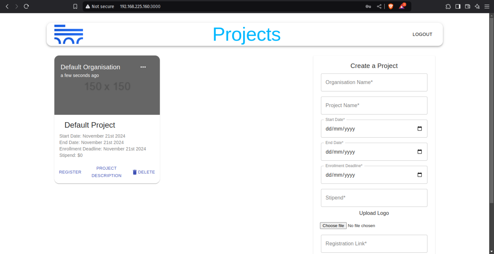

# Projects-Kadal

This project is a web application for managing and viewing projects. It includes an admin login system for creating and managing project entries.

## Features

- View projects
- Admin login for managing projects
- Create, update, and delete projects
- Default project card when no projects are available

## Prerequisites

- Node.js (v14 or later)
- npm (v6 or later)
- MongoDB (Atlas or local instance)

## Setup

### 1. Clone the Repository

```sh
git clone https://github.com/your-username/Projects-Kadal.git
cd Projects-Kadal
```
### 2. Install Dependencies

#### Server
```sh
cd server
npm install
```

#### Client
```sh
cd ../client
npm install
```

### 3. Configure Environment Variables
Create a .env file in the server directory and add your MongoDB connection string:
```sh
MONGODB_URI=your_mongodb_connection_string
```

### 4. Seed Default Admin User

- Username: admin
- Password: admin123

### 5. Start the Server

```sh
cd server
npm start
```

### 6. Start the Client

```sh
cd ../client
npm start
```

### Usage

#### Admin Login
- Navigate to http://localhost:3000/signin.
- Log in with the default admin credentials:
    - Username: admin
    - Password: admin123

#### Viewing Projects
- Navigate to http://localhost:3000/ to view the projects.
- If no projects are available, a default project card will be displayed.

#### Managing Projects

After logging in as an admin, you can create and delete projects.

### Screenshots


